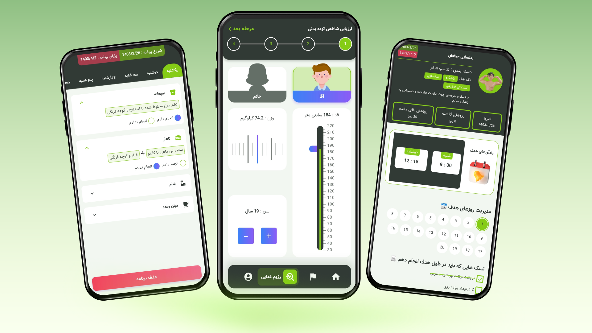

# 🌿 Hamrah Salamt

## 📝 Description
This application is designed with the aim of managing and improving a healthy lifestyle, which helps you achieve health by providing weekly food planning systems and a smart targeting system. Also, with access to a collection of scientific articles in the fields of sports, yoga and medicine, it allows to improve knowledge and improve a healthier lifestyle.

## 🔑 Key Features

### 🍴 Smart meal planning
This feature allows you to intelligently set and manage your weekly schedule.
You will be able to receive the meal plan in 3 ways:

- Manual meal plan
- Ready meal plan
  - Suitable for overweight people
  - Suitable for underweight people
  - Suitable for weight stabilization
- Diet plan created by AI to suit your needs(Developing)

### 🎯 Targeting and reminders
The feature allows you to create goals in different categories with the ability to set the reminders needed for that goal. 
Features of a target

- Category
- Tags
- Start and end date
- Description
- Title
- Reminders and notifications
- Tasks
- Ability to manage and record daily approach

### 🫀 BMI calculator
This feature allows you to calculate your body mass index based on gender, age, height and weight and also informs you about the explanations related to your body mass index.

### 🧬 BMR calculator
This feature allows you to calculate your body's metabolic rate (BMR), which includes food, protein, carbohydrates, and daily requirements based on your daily activity level.

### 📄 Scientific and health articles
Access the best and most up-to-date articles on medicine, health and hygiene.

### 🧘‍♂️ Sports and yoga exercises
You can do the best yoga and exercise exercises along with movement training animation and movement steps

## 🛠️ Technologies Used
 - Language: Dart
 - Framework: Flutter
 - Database: SQLite
 - Design System: Material UI 

 ## 🤝 Contribute
 Hamidreza Mohammadi: https://github.com/LegendisM